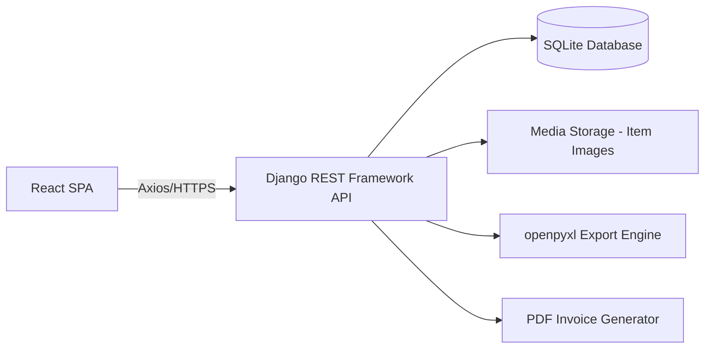
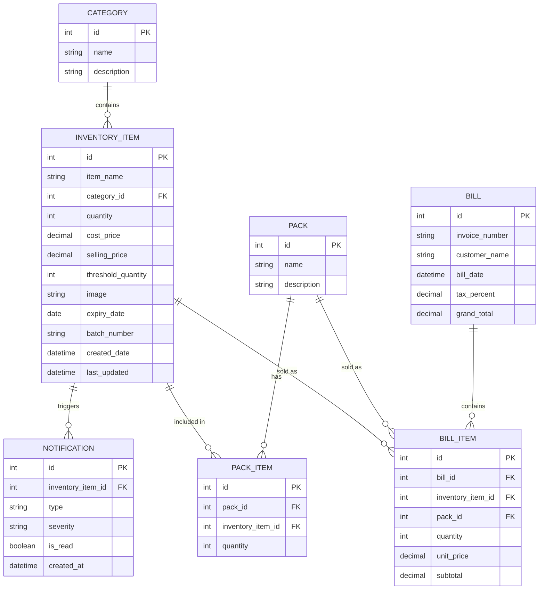
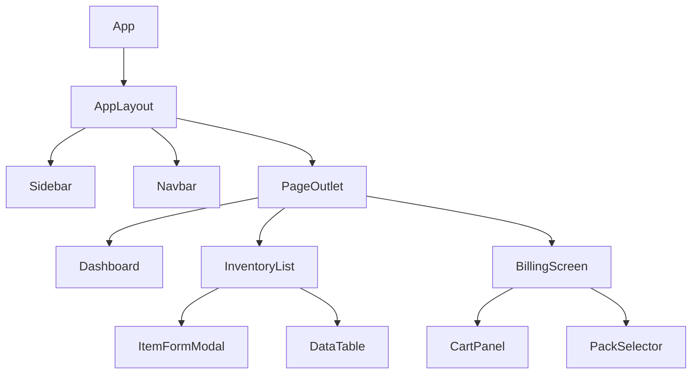
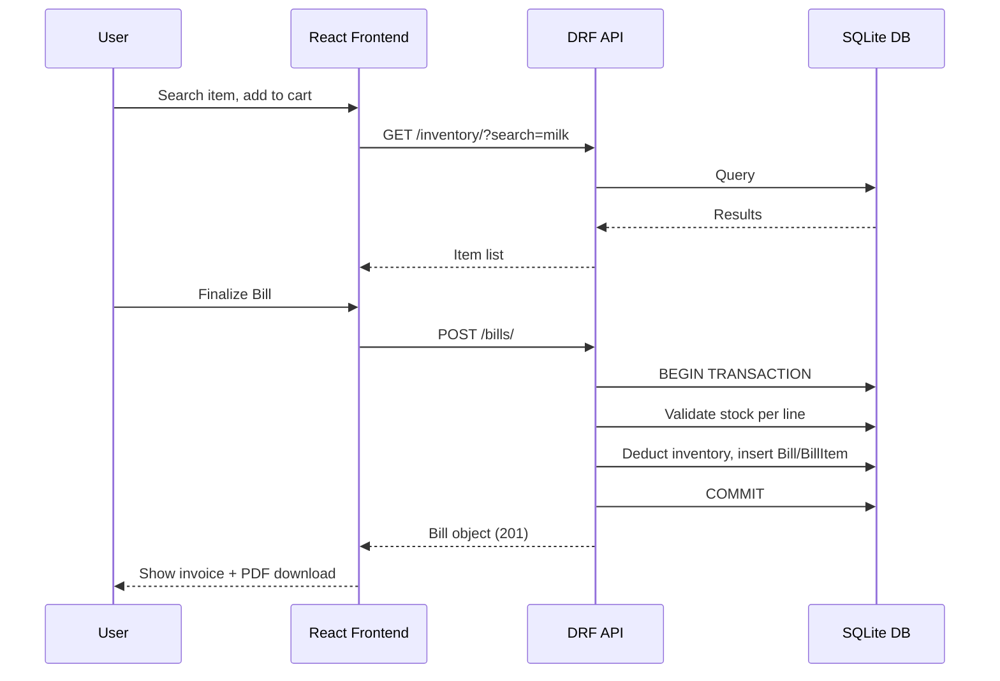

# Software Requirements Specification (SRS)
## Inventory Management System (IMS)

**Version:** 1.0
**Prepared for:** College Capstone Project — Real-World Grade Implementation
**Document Standard:** IEEE 830 (adapted)
**Tech Stack:** React + Django REST Framework + SQLite

---

## Table of Contents

1. Introduction
2. Overall Description
3. System Features (Functional Requirements)
4. External Interface Requirements (UI/UX)
5. Database Design
6. API Design
7. Validation Rules
8. Non-Functional Requirements
9. Testing Strategy
10. Phased Development Plan
11. Architecture & Folder Structure
12. Coding Standards & Conventions
13. Deployment & Backup Strategy
14. Risk Analysis, Assumptions & Limitations
15. Future Enhancements
16. Glossary

---

## 1. Introduction

### 1.1 Purpose
This SRS defines the functional and non-functional requirements for an **Inventory Management System (IMS)** — a web application enabling small-to-medium businesses to manage stock, categories, sales billing, batch/expiry tracking, notifications, and analytics through a modern ERP-style dashboard.

### 1.2 Scope
The system provides:
- Inventory CRUD with **batch/expiry-aware** record separation (no quantity merging across batches).
- Category management.
- Automated low-stock and expiry notifications.
- Point-of-sale style billing with automatic stock deduction and PDF invoices.
- Reusable "batch packs" (bundled items sold as one unit).
- Excel export of inventory.
- Dashboard with KPIs and interactive charts.
- Analytics on sales, revenue, cost, and stock trends.

Out of scope for v1: multi-warehouse, supplier/purchase-order management, GST/tax compliance engine, role-based auth beyond a single admin role (see Section 15).

### 1.3 Intended Audience
Developers (including AI coding assistants such as Claude Code, Cursor, Windsurf), project evaluators, and maintainers.

### 1.4 Definitions & Acronyms

| Term | Meaning |
|---|---|
| IMS | Inventory Management System |
| SKU-Record | A single inventory row identified by item+batch+expiry combination |
| DRF | Django REST Framework |
| JWT | JSON Web Token |
| NFR | Non-Functional Requirement |
| CRUD | Create, Read, Update, Delete |

### 1.5 Document Conventions
- `MUST` = mandatory requirement. `SHOULD` = recommended. `MAY` = optional.
- All API paths are prefixed with `/api/v1/`.
- All monetary values stored as `DECIMAL(10,2)`.

---

## 2. Overall Description

### 2.1 Product Perspective
IMS is a standalone, self-hosted, single-tenant web application: a React Single Page Application (SPA) consuming a Django REST Framework JSON API, backed by SQLite.



### 2.2 User Classes

| Role | Description | v1 Access |
|---|---|---|
| Admin/Owner | Full access to all modules | Yes (default, single role) |
| Staff/Cashier | Billing + inventory view only | Planned (Phase — Future Enhancement, RBAC) |

### 2.3 Operating Environment
- Backend: Python 3.11+, Django 5.x, DRF 3.15+
- Frontend: React 18+, Node 18+
- Database: SQLite (file-based, dev/small-scale production)
- Browsers: Chrome, Firefox, Edge (last 2 versions)

### 2.4 Design & Implementation Constraints
- SQLite limits concurrent writes — acceptable for target scale (single business, <50 concurrent users).
- No external paid services; all libraries open-source.
- Must be phase-buildable: each phase independently runnable and demoable.

### 2.5 Assumptions & Dependencies
See Section 14.

---

## 3. System Features (Functional Requirements)

### 3.1 Category Management
- FR-CAT-1: User **MUST** be able to create a category with `name` (unique, required) and `description` (optional).
- FR-CAT-2: User **MUST** be able to edit and delete a category (soft-delete if items reference it — deletion blocked with error if items exist).
- FR-CAT-3: User **MUST** be able to search categories by name (live search).

### 3.2 Inventory Management
- FR-INV-1: User **MUST** be able to add an inventory item with: Item Name, Category (FK), Quantity, Cost Price, Selling Price, Threshold Quantity, Image (optional), Expiry Date (optional), Batch Number (optional).
- FR-INV-2: **Critical Rule** — If an item with the same name arrives with a **different expiry date or batch number**, the system **MUST** create a **new, separate inventory record**, never merging quantities with an existing record. Uniqueness key = (`item_name`, `category`, `batch_number`, `expiry_date`).
- FR-INV-3: User **MUST** be able to edit and delete an individual inventory record (batch-level, not item-level).
- FR-INV-4: User **MUST** be able to search, filter (by category, stock status, expiry status), and sort (name, quantity, price, expiry, created date) inventory records.
- FR-INV-5: System **MUST** auto-populate `created_date` and `last_updated` timestamps.
- FR-INV-6: List views **MUST** support pagination (default 20/page).

### 3.3 Low Stock Notifications
- FR-LOW-1: System **MUST** evaluate `current_quantity < threshold_quantity` on every stock-changing operation (create, edit, sale) and generate/update a notification record.
- FR-LOW-2: Notification **MUST** contain item name, current quantity, threshold, and computed severity (`Critical` if qty = 0, `High` if qty < 50% of threshold, else `Warning`).
- FR-LOW-3: Dashboard **MUST** display a Low Stock Widget listing top N low-stock items.

### 3.4 Expiry Notifications
- FR-EXP-1: System **MUST** classify each batch record daily (via scheduled check or on-demand computed property) into: `Expired`, `Expiring in 7 days`, `Expiring in 30 days`, `Safe`.
- FR-EXP-2: User **MUST** be able to filter inventory/notification views by expiry classification.

### 3.5 Sales / Billing Module
- FR-SALE-1: User **MUST** be able to create a sales bill by searching items, selecting quantity per item.
- FR-SALE-2: System **MUST** validate requested quantity ≤ available stock for that exact batch record before allowing addition to bill; reject with a clear error otherwise.
- FR-SALE-3: On bill finalization, system **MUST** atomically deduct quantities from the corresponding inventory records and persist the bill (transaction — all-or-nothing).
- FR-SALE-4: Bill **MUST** store: Invoice Number (auto-incrementing, unique), Customer Name (optional), Date, Line Items (item, batch, qty, unit price, subtotal), Tax (optional, percentage-based), Grand Total.
- FR-SALE-5: User **MUST** be able to view/print the invoice and download it as a PDF.

### 3.6 Batch Packs (Bundles)
- FR-PACK-1: User **MUST** be able to create a named Pack containing multiple inventory items with defined quantities each (e.g., "Hygiene Pack").
- FR-PACK-2: Selecting a Pack during billing **MUST** auto-add all constituent items to the bill and deduct each item's inventory individually upon sale.
- FR-PACK-3: If any constituent item lacks sufficient stock, system **MUST** reject adding the whole pack and report which item(s) are insufficient.

### 3.7 Export
- FR-EXP-EXCEL-1: User **MUST** be able to export the current (filtered) inventory view to an `.xlsx` file via `openpyxl`/`pandas`.
- FR-EXP-EXCEL-2: Export **MUST** respect active filters (category, stock status, expiry status, search term).

### 3.8 Dashboard
- FR-DASH-1: Dashboard **MUST** show: Total Products, Low Stock Count, Expiring Soon Count, Expired Count, Today's Sales, Monthly Sales, Monthly Revenue, Monthly Cost, Monthly Profit.
- FR-DASH-2: Dashboard **MUST** render Bar, Pie, Line, and Area charts (via Chart.js/Recharts) for revenue and category trends.
- FR-DASH-3: Dashboard **MUST** show Recent Activities, Recent Bills, and unread Notifications.

### 3.9 Analytics
- FR-ANL-1: System **MUST** provide analytics endpoints for: Monthly Revenue/Cost/Sales/Profit, Top/Least Selling Products, Category-wise Sales, Inventory Value, Stock Movement, Low Stock Trend, Expiry Trend.
- FR-ANL-2: Charts **MUST** be interactive (tooltips, legend toggling, date-range filters).

### 3.10 Search, Filter, Sort, Pagination (Global)
- FR-SRCH-1: All list endpoints **MUST** accept `search`, `ordering`, and pagination (`page`, `page_size`) query parameters (DRF `SearchFilter`/`OrderingFilter`/`PageNumberPagination`).

---

## 4. External Interface Requirements (UI/UX)

### 4.1 Design Direction
Modern ERP aesthetic (Zoho Inventory / Odoo style): persistent left sidebar, top navbar with global search + profile menu, card-based KPI tiles, soft shadows, rounded corners (8–12px radius), a professional palette (e.g., deep indigo primary, slate neutrals, semantic green/amber/red for status), and full **Dark Mode** support via a theme toggle and CSS variables.

### 4.2 Core Screens

| Screen | Key Elements |
|---|---|
| Login | (Phase-1 stub, expandable later to RBAC) |
| Dashboard | KPI cards, charts, low-stock widget, recent bills, notifications panel |
| Inventory List | Data table, search bar, filter chips, sort headers, pagination, "Add Item" button, empty-state illustration |
| Item Add/Edit Form | React Hook Form with validation, image upload with preview |
| Category List/Form | Table + modal form |
| Billing Screen | Item search-select, cart panel, pack selector, running total, "Finalize Bill" button |
| Invoice View | Printable layout, "Download PDF" button |
| Notifications Center | Tabs: Low Stock / Expiry, severity badges |
| Analytics | Date-range picker, chart grid, export buttons |
| Export | Filter summary + "Download Excel" button |

### 4.3 UX Requirements
- Loading skeletons on all async data fetches.
- Toast notifications for success/error feedback (non-blocking).
- Confirmation dialogs for destructive actions (delete item/category).
- Empty-state illustrations when lists are empty (e.g., "No items yet — add your first item").
- Framer Motion transitions for route changes, modal open/close, and list item entry.
- Fully responsive: desktop, tablet, mobile breakpoints (sidebar collapses to a drawer on mobile).
- Accessibility: semantic HTML, ARIA labels on icons/buttons, sufficient color contrast (WCAG AA).

---

## 5. Database Design

### 5.1 Entity Relationship Diagram



### 5.2 Table Definitions

**Category**
| Field | Type | Constraints |
|---|---|---|
| id | Integer | PK, auto-increment |
| name | Varchar(100) | Unique, Not Null |
| description | Text | Nullable |

**InventoryItem** (unique constraint on `item_name + category_id + batch_number + expiry_date` enforces the "no merge" rule)
| Field | Type | Constraints |
|---|---|---|
| id | Integer | PK |
| item_name | Varchar(150) | Not Null, Indexed |
| category_id | FK → Category | Not Null |
| quantity | Integer | Not Null, ≥ 0 |
| cost_price | Decimal(10,2) | Not Null, ≥ 0 |
| selling_price | Decimal(10,2) | Not Null, ≥ 0 |
| threshold_quantity | Integer | Not Null, ≥ 0, default 10 |
| image | Varchar(255) | Nullable (media path) |
| expiry_date | Date | Nullable |
| batch_number | Varchar(50) | Nullable |
| created_date | DateTime | Auto |
| last_updated | DateTime | Auto (on save) |

**Pack** / **PackItem** — Pack has many PackItems; PackItem links Pack ↔ InventoryItem with a required quantity.

**Bill** — `invoice_number` unique, auto-generated as `INV-{year}-{sequence}`.

**BillItem** — links to either an `inventory_item` OR a `pack` (mutually exclusive; pack sales expand into per-item deductions at transaction time, but the BillItem row records the pack reference for invoice display, with expanded rows also recorded for audit).

**Notification** — `type` ∈ {`LOW_STOCK`, `EXPIRING_SOON`, `EXPIRED`}; `severity` ∈ {`WARNING`, `HIGH`, `CRITICAL`}.

### 5.3 Normalization
Schema is in **3NF**: no repeating groups (1NF), all non-key attributes fully dependent on the primary key (2NF), no transitive dependencies (3NF) — e.g., category name/description live only in `Category`, referenced by FK, not duplicated in `InventoryItem`.

### 5.4 Indexing Strategy
- Index on `InventoryItem.item_name` (search performance).
- Composite index on `(category_id, expiry_date)` for expiry-filtered category views.
- Index on `Bill.invoice_number` and `Bill.bill_date`.

---

## 6. API Design

All endpoints return JSON; errors follow `{ "error": "message", "details": {...} }`.

### 6.1 Category Endpoints

| Method | Endpoint | Description |
|---|---|---|
| GET | `/api/v1/categories/` | List (search, pagination) |
| POST | `/api/v1/categories/` | Create |
| GET | `/api/v1/categories/{id}/` | Retrieve |
| PUT | `/api/v1/categories/{id}/` | Update |
| DELETE | `/api/v1/categories/{id}/` | Delete (409 if items reference it) |

**POST Request:** `{ "name": "Beverages", "description": "Cold drinks" }`
**Response 201:** `{ "id": 1, "name": "Beverages", "description": "Cold drinks" }`
**Errors:** `400` duplicate name; `400` missing name.

### 6.2 Inventory Endpoints

| Method | Endpoint | Description |
|---|---|---|
| GET | `/api/v1/inventory/` | List (search, filter, ordering, pagination) |
| POST | `/api/v1/inventory/` | Create item (multipart for image) |
| GET | `/api/v1/inventory/{id}/` | Retrieve |
| PUT/PATCH | `/api/v1/inventory/{id}/` | Update |
| DELETE | `/api/v1/inventory/{id}/` | Delete |
| GET | `/api/v1/inventory/?expiry_status=expired\|expiring_7\|expiring_30\|safe` | Filter by expiry |
| GET | `/api/v1/inventory/?stock_status=low\|ok` | Filter by stock |
| GET | `/api/v1/inventory/export/` | Excel export (respects filters) |

**POST Request:**
```json
{
  "item_name": "Milk",
  "category": 2,
  "quantity": 100,
  "cost_price": 20.00,
  "selling_price": 28.00,
  "threshold_quantity": 15,
  "expiry_date": "2026-07-20",
  "batch_number": "B-102"
}
```
**Response 201:** full object with `id`, `created_date`, `last_updated`.
**Errors:** `400` negative quantity/price; `400` invalid date format; `404` invalid category.

### 6.3 Notifications

| Method | Endpoint | Description |
|---|---|---|
| GET | `/api/v1/notifications/?type=LOW_STOCK\|EXPIRING_SOON\|EXPIRED` | List notifications |
| PATCH | `/api/v1/notifications/{id}/` | Mark as read |

### 6.4 Sales / Billing

| Method | Endpoint | Description |
|---|---|---|
| GET | `/api/v1/bills/` | List bills (search, date range) |
| POST | `/api/v1/bills/` | Create bill (transactional) |
| GET | `/api/v1/bills/{id}/` | Retrieve bill |
| GET | `/api/v1/bills/{id}/pdf/` | Download invoice PDF |

**POST Request:**
```json
{
  "customer_name": "Walk-in",
  "tax_percent": 5,
  "items": [
    { "inventory_item": 12, "quantity": 2 },
    { "pack": 3, "quantity": 1 }
  ]
}
```
**Response 201:** bill object with computed `subtotal`, `tax_amount`, `grand_total`, and expanded `line_items`.
**Errors:** `400` insufficient stock (names the offending item(s)); `404` invalid item/pack id.

### 6.5 Packs

| Method | Endpoint | Description |
|---|---|---|
| GET | `/api/v1/packs/` | List |
| POST | `/api/v1/packs/` | Create with `items: [{inventory_item, quantity}]` |
| PUT | `/api/v1/packs/{id}/` | Update |
| DELETE | `/api/v1/packs/{id}/` | Delete |

### 6.6 Dashboard & Analytics

| Method | Endpoint | Description |
|---|---|---|
| GET | `/api/v1/dashboard/summary/` | KPI totals |
| GET | `/api/v1/analytics/revenue/?range=monthly` | Revenue/cost/profit series |
| GET | `/api/v1/analytics/top-products/` | Top/least selling products |
| GET | `/api/v1/analytics/category-sales/` | Category-wise sales breakdown |
| GET | `/api/v1/analytics/stock-movement/` | Stock in/out over time |

---

## 7. Validation Rules

| Field | Rule |
|---|---|
| item_name | Required, 2–150 chars |
| category | Required, must exist |
| quantity | Integer, ≥ 0 |
| cost_price | Decimal ≥ 0, ≤ 9,999,999.99 |
| selling_price | Decimal ≥ 0, must be ≥ cost_price (warn, not block, if lower — flag as "selling at loss") |
| threshold_quantity | Integer ≥ 0, default 10 |
| expiry_date | Valid ISO date if provided; if provided, cannot be earlier than 1900-01-01 |
| batch_number | Optional, max 50 chars, alphanumeric + hyphen |
| image | Max 5MB, JPEG/PNG/WebP only |
| category.name | Required, unique, 2–100 chars |
| bill.customer_name | Optional, max 150 chars |
| bill.tax_percent | 0–100 |
| bill line quantity | Must not exceed available stock for that exact batch record |
| pack.name | Required, unique |
| pack items | At least 1 item required |

---

## 8. Non-Functional Requirements

| Category | Requirement |
|---|---|
| Performance | List endpoints respond < 500ms for ≤10k records; pagination enforced server-side |
| Security | CSRF protection, input sanitization, DRF permission classes, HTTPS in production |
| Maintainability | Modular Django apps per domain (inventory, sales, notifications, analytics) |
| Scalability | Stateless API layer; SQLite swappable for PostgreSQL with minimal ORM changes |
| Reliability | Bill creation wrapped in DB transactions (atomic stock deduction) |
| Accessibility | WCAG AA color contrast, keyboard navigation, ARIA labels |
| Responsiveness | Breakpoints at 480px / 768px / 1024px / 1440px |
| Browser Compatibility | Latest 2 versions of Chrome, Firefox, Edge, Safari |
| Error Handling | Global API error interceptor (Axios) mapped to toast notifications |
| Logging | Django logging to rotating file handler; frontend error boundary logs to console/service |

---

## 9. Testing Strategy

Each module requires positive, negative, and edge-case tests.

**Example — Inventory Module**

| Case Type | Scenario | Expected Result |
|---|---|---|
| Positive | Add item with valid data | 201, record created |
| Positive | Add same item name, different batch/expiry | New separate record created, no merge |
| Negative | Add item with negative quantity | 400 validation error |
| Negative | Add item with invalid category id | 404 |
| Edge | Quantity exactly equals threshold | Not flagged low-stock (strictly less-than) |
| Edge | Expiry date exactly 7 days away | Classified "Expiring in 7 days" |
| Edge | Selling item quantity equal to available stock | Succeeds, resulting stock = 0, triggers low-stock notification |

Similar tables (positive/negative/edge) **MUST** be produced per module during implementation for: Category, Sales/Billing, Packs, Notifications, Export, Analytics.

Testing tools: `pytest-django` / DRF `APITestCase` (backend), `React Testing Library` + `Jest` (frontend), Postman/Thunder Client collections for manual API verification.

---

## 10. Phased Development Plan

> Each phase is fully functional and demoable before the next begins. No phase depends on incomplete future work.

### Phase 1 — Project Setup & Scaffolding
- **Objective:** Establish working full-stack skeleton.
- **Features:** Django project + DRF installed; React app (Vite/CRA) with routing, Axios instance, base layout (sidebar + navbar).
- **UI Screens:** Empty dashboard shell, sidebar, navbar, dark-mode toggle.
- **Backend APIs:** `GET /api/v1/health/`.
- **DB Changes:** Initial migrations (empty app).
- **Testing:** Health check returns 200.
- **Completion Criteria:** Both servers run; frontend fetches health endpoint successfully.
- **Complexity:** Low.
- **Git Milestone:** `chore: initial project scaffolding`.
- **AI Prompt:** "Set up a Django + DRF backend and a React (Vite) frontend with Axios configured to call the backend, a base layout with sidebar/navbar, and dark mode toggle using CSS variables. Add a `/api/v1/health/` endpoint returning `{status:'ok'}`. Do not implement any business features yet."

### Phase 2 — Category Management
- **Features:** Category CRUD + search.
- **UI Screens:** Category list (table + search), Add/Edit modal.
- **APIs:** Category endpoints (Section 6.1).
- **DB Changes:** `Category` model + migration.
- **Testing:** CRUD + duplicate-name validation.
- **Completion Criteria:** Full category CRUD works end-to-end via UI.
- **Complexity:** Low.
- **Git Milestone:** `feat: category management module`.
- **AI Prompt:** "Implement the Category model, serializer, viewset, and REST endpoints exactly as specified in Section 5.2 and 6.1 of the SRS. Build a React Category List page with search, and a modal form for add/edit, using toast notifications for feedback. Include delete-confirmation dialog and block deletion with a clear error if items reference the category."

### Phase 3 — Inventory CRUD (Core, Batch-Aware)
- **Features:** Add/Edit/Delete inventory records; enforce no-merge-on-duplicate-batch rule; image upload.
- **UI Screens:** Inventory list (basic), Add/Edit item form with image preview.
- **APIs:** Inventory CRUD endpoints.
- **DB Changes:** `InventoryItem` model with unique constraint per Section 5.2.
- **Testing:** Positive/negative/edge cases from Section 9.
- **Completion Criteria:** Two records of the same item name with different batch/expiry appear as separate rows.
- **Complexity:** Medium.
- **Git Milestone:** `feat: inventory CRUD with batch-aware records`.
- **AI Prompt:** "Implement the InventoryItem model with the exact unique constraint (item_name, category, batch_number, expiry_date) so duplicate-name items with different batch/expiry create separate records instead of merging quantities. Build DRF endpoints and a React form (React Hook Form) with validation per Section 7, including optional image upload with preview."

### Phase 4 — Inventory Search, Filter, Sort, Pagination
- **Features:** Live search, category/stock/expiry filters, column sorting, pagination.
- **UI Screens:** Enhanced inventory list with filter chips and sort headers.
- **APIs:** Query params on `GET /inventory/` (search, ordering, filters, page).
- **DB Changes:** None (indexes only, from Section 5.4).
- **Testing:** Filter combinations, empty-result state.
- **Completion Criteria:** All filters/sort/search work together correctly with pagination.
- **Complexity:** Medium.
- **Git Milestone:** `feat: inventory search, filter, sort, pagination`.
- **AI Prompt:** "Add DRF SearchFilter, OrderingFilter, and PageNumberPagination to the inventory viewset, plus custom filters for stock_status and expiry_status as described in Section 6.2. Update the React inventory list to add a search bar, filter chips, sortable column headers, and pagination controls with loading skeletons."

### Phase 5 — Low Stock Notifications
- **Features:** Auto-generate/update low-stock notifications on any stock change.
- **UI Screens:** Low Stock Widget on dashboard stub; Notifications Center (low-stock tab).
- **APIs:** Notification endpoints filtered by `LOW_STOCK`.
- **DB Changes:** `Notification` model.
- **Testing:** Threshold boundary cases (Section 9).
- **Completion Criteria:** Editing quantity below threshold produces a notification visible in the UI.
- **Complexity:** Medium.
- **Git Milestone:** `feat: low stock notifications`.
- **AI Prompt:** "Implement the Notification model and logic to create/update a LOW_STOCK notification whenever an inventory item's quantity drops below its threshold (strictly less-than), with severity computed per Section 3.3. Add a Notifications Center page with a Low Stock tab and a dashboard widget component."

### Phase 6 — Expiry Notifications
- **Features:** Expired / Expiring-in-7 / Expiring-in-30 classification and filtering.
- **UI Screens:** Notifications Center (expiry tab), expiry filter chips reused in inventory list.
- **APIs:** Expiry-status filter (already scaffolded in Phase 4) + notification generation for `EXPIRING_SOON`/`EXPIRED`.
- **DB Changes:** None beyond existing fields.
- **Testing:** Exact-boundary date cases.
- **Completion Criteria:** Items correctly bucketed and filterable; notifications generated.
- **Complexity:** Medium.
- **Git Milestone:** `feat: expiry notifications and filtering`.
- **AI Prompt:** "Add a computed expiry classification (Expired / Expiring in 7 days / Expiring in 30 days / Safe) to the inventory serializer and generate EXPIRING_SOON/EXPIRED notifications accordingly. Add an expiry tab to the Notifications Center with filter support."

### Phase 7 — Sales / Billing Module (Core)
- **Features:** Create bill, search-select items, stock validation, atomic deduction, invoice numbering.
- **UI Screens:** Billing screen (item search, cart, totals), Invoice view (screen-printable).
- **APIs:** Bill create/list/retrieve endpoints (Section 6.4, without packs yet).
- **DB Changes:** `Bill`, `BillItem` models.
- **Testing:** Stock-insufficient rejection, transactional rollback on partial failure.
- **Completion Criteria:** A bill can be created, stock is correctly deducted, invoice is viewable.
- **Complexity:** High.
- **Git Milestone:** `feat: sales billing core with atomic stock deduction`.
- **AI Prompt:** "Implement Bill and BillItem models and a transactional bill-creation endpoint that validates stock per line item and atomically deducts inventory, generating an auto-incrementing invoice number (INV-{year}-{seq}). Build a React billing screen with item search-select, a running cart, and a printable invoice view."

### Phase 8 — Invoice PDF Export
- **Features:** Download invoice as PDF.
- **UI Screens:** "Download PDF" button on invoice view.
- **APIs:** `GET /bills/{id}/pdf/`.
- **DB Changes:** None.
- **Testing:** PDF content matches bill data.
- **Completion Criteria:** Valid PDF downloads with correct line items and totals.
- **Complexity:** Medium.
- **Git Milestone:** `feat: invoice PDF export`.
- **AI Prompt:** "Add a server-side PDF generation endpoint for bills (using a Python PDF library) that renders invoice number, customer, date, line items, subtotal, tax, and grand total, matching the on-screen invoice layout. Wire up a Download PDF button."

### Phase 9 — Batch Packs
- **Features:** Create/edit/delete packs; sell packs with per-item stock deduction and insufficiency reporting.
- **UI Screens:** Pack management page; pack selector in billing screen.
- **APIs:** Pack CRUD endpoints; billing endpoint extended to accept pack line items.
- **DB Changes:** `Pack`, `PackItem` models; `BillItem.pack` FK.
- **Testing:** Partial-stock pack rejection naming the offending item.
- **Completion Criteria:** Selling a pack deducts every constituent item correctly.
- **Complexity:** High.
- **Git Milestone:** `feat: batch packs with bundled billing`.
- **AI Prompt:** "Implement Pack and PackItem models and CRUD endpoints. Extend the bill-creation endpoint to accept pack references, expanding them into per-item stock checks and deductions, rejecting the whole pack with a clear message if any constituent item lacks sufficient stock. Add pack management UI and a pack selector in the billing screen."

### Phase 10 — Excel Export
- **Features:** Export current filtered inventory view to `.xlsx`.
- **UI Screens:** Export button on inventory list.
- **APIs:** `GET /inventory/export/`.
- **DB Changes:** None.
- **Testing:** Exported file matches applied filters.
- **Completion Criteria:** Downloaded file opens correctly and reflects active filters.
- **Complexity:** Low–Medium.
- **Git Milestone:** `feat: inventory excel export`.
- **AI Prompt:** "Add an export endpoint that generates an .xlsx file (via openpyxl or pandas) from the same filtered/searched/sorted queryset used by the inventory list endpoint, and a frontend Export button that triggers the download while preserving current filters."

### Phase 11 — Dashboard (KPIs & Charts)
- **Features:** Full KPI summary, bar/pie/line/area charts, recent bills, recent activity feed.
- **UI Screens:** Complete Dashboard page.
- **APIs:** `GET /dashboard/summary/`.
- **DB Changes:** None (aggregation queries only).
- **Testing:** KPI numbers match underlying data across edge cases (empty data, single record).
- **Completion Criteria:** Dashboard reflects live data with working charts.
- **Complexity:** Medium.
- **Git Milestone:** `feat: dashboard KPIs and charts`.
- **AI Prompt:** "Implement a dashboard summary endpoint aggregating totals for products, low stock, expiring soon, expired, today's/monthly sales, monthly revenue/cost/profit. Build a React dashboard using Recharts/Chart.js for bar, pie, line, and area charts, plus recent bills and recent activity lists, with loading skeletons."

### Phase 12 — Analytics Module
- **Features:** Monthly revenue/cost/sales/profit trends, top/least-selling products, category-wise sales, inventory value, stock movement, low-stock/expiry trends.
- **UI Screens:** Analytics page with date-range filters and interactive charts.
- **APIs:** Analytics endpoints (Section 6.6).
- **DB Changes:** None (aggregation only; consider indexed views if scale grows).
- **Testing:** Correctness of aggregations against seeded data.
- **Completion Criteria:** All analytics charts render correctly and respond to date-range changes.
- **Complexity:** High.
- **Git Milestone:** `feat: analytics module`.
- **AI Prompt:** "Implement analytics endpoints for revenue/cost/sales/profit trends, top/least selling products, category-wise sales, inventory value, and stock movement, all accepting a date-range parameter. Build an Analytics page with interactive charts and a date-range picker."

### Phase 13 — UI/UX Polish (Dark Mode, Animations, Empty States)
- **Features:** Finalize dark mode across all screens, Framer Motion transitions, empty-state illustrations, loading skeletons everywhere, toast/confirmation consistency pass.
- **UI Screens:** All screens (polish pass).
- **APIs:** None.
- **DB Changes:** None.
- **Testing:** Manual UX review checklist; accessibility audit (contrast, keyboard nav).
- **Completion Criteria:** Consistent, professional look and feel across the entire app in both themes.
- **Complexity:** Medium.
- **Git Milestone:** `polish: dark mode, animations, empty states, accessibility`.
- **AI Prompt:** "Perform a UI polish pass across all existing screens: ensure dark mode via CSS variables works everywhere, add Framer Motion transitions for route/modal changes, add empty-state illustrations for all list views, ensure loading skeletons and toasts are used consistently, and fix any accessibility contrast/keyboard-navigation issues."

### Phase 14 — Testing, Hardening & Deployment Prep
- **Features:** Backend test suite completion (all modules), frontend component tests, error-boundary review, environment-variable cleanup, production build.
- **UI Screens:** None new.
- **APIs:** None new.
- **DB Changes:** None.
- **Testing:** Full regression pass against Section 9 test matrices for every module.
- **Completion Criteria:** All test suites pass; production build succeeds; deployment checklist (Section 13) satisfied.
- **Complexity:** Medium.
- **Git Milestone:** `chore: test hardening and deployment readiness`.
- **AI Prompt:** "Write comprehensive positive/negative/edge-case tests for every module (Category, Inventory, Notifications, Billing, Packs, Export, Analytics) using pytest-django APITestCase and React Testing Library. Fix any bugs found. Prepare production build configuration and environment variable documentation per Section 13."

---

## 11. Architecture & Folder Structure

### 11.1 Backend (Django) Structure
```
backend/
├── config/                # settings, urls, wsgi/asgi
├── categories/             # Category app
├── inventory/               # InventoryItem app
├── notifications/            # Notification app
├── sales/                  # Bill, BillItem app
├── packs/                  # Pack, PackItem app
├── analytics/               # Aggregation views
├── media/                  # Uploaded item images
└── manage.py
```

### 11.2 Frontend (React) Structure
```
frontend/
├── src/
│   ├── api/                # Axios instance + endpoint modules
│   ├── components/          # Reusable UI (Card, Table, Modal, Skeleton, Toast)
│   ├── pages/                # Dashboard, Inventory, Categories, Billing, Analytics
│   ├── layouts/              # Sidebar, Navbar, AppLayout
│   ├── hooks/                # useDebouncedSearch, usePagination
│   ├── context/               # ThemeContext (dark mode)
│   ├── router/                # React Router config
│   └── App.jsx
```

### 11.3 Component Hierarchy (Simplified)


### 11.4 State Management Strategy
- Local component state via `useState`/`useReducer` for forms.
- Server-state caching via a lightweight fetch hook pattern (or React Query if permitted) to avoid redundant API calls.
- Global `ThemeContext` for dark mode only; no heavy global store needed at this scale.

### 11.5 Sequence Diagram — Sales Transaction


---

## 12. Coding Standards & Conventions

- **Python:** PEP8, Black formatting, snake_case for functions/variables, PascalCase for classes.
- **Django apps:** one domain per app (see 11.1); serializers in `serializers.py`, views in `views.py` using DRF `ModelViewSet` where possible.
- **React:** functional components + Hooks only; PascalCase component filenames; camelCase variables/functions; one component per file.
- **API naming:** plural nouns, kebab/underscore-free paths, versioned under `/api/v1/`.
- **Environment variables:** `.env` for `DEBUG`, `SECRET_KEY`, `ALLOWED_HOSTS`, `MEDIA_ROOT`, `CORS_ALLOWED_ORIGINS`, frontend `VITE_API_BASE_URL`.
- **Git commits:** Conventional Commits style (`feat:`, `fix:`, `chore:`, `polish:`, `test:`).

---

## 13. Deployment & Backup Strategy

- **Dev:** `python manage.py runserver` + `npm run dev` (Vite proxy to backend).
- **Production (small-scale):** Gunicorn + Nginx serving the built React bundle as static files, Nginx reverse-proxying `/api/` to Gunicorn.
- **Database backup:** Scheduled copy of the SQLite `.db` file (cron job) to a backup directory/cloud storage; media folder backed up alongside.
- **Deployment checklist:** `DEBUG=False`, secret key from env, `collectstatic` run, CORS restricted to production domain, HTTPS enforced.

---

## 14. Risk Analysis, Assumptions & Limitations

| Risk | Mitigation |
|---|---|
| SQLite write contention at scale | Document PostgreSQL migration path; keep ORM-only queries (no raw SQL) |
| Concurrent bill creation race conditions | Use `select_for_update()` within the transaction |
| Image storage growth | Enforce 5MB limit, periodic cleanup of orphaned files |
| Scope creep beyond phases | Strict phase completion criteria before starting next phase |

**Assumptions:** Single admin user in v1; all currency in one denomination; no multi-warehouse.

**Limitations:** No role-based access control in v1; no supplier/purchase-order tracking; no GST-compliant tax engine; single-location inventory only.

---

## 15. Future Enhancements

Barcode/QR code scanning, Role-Based Authentication, GST-compliant billing, Supplier management, Purchase Orders, Customer Management (CRM-lite), Multi-Warehouse support, Cloud backup automation, Audit logs, Email notifications, SMS notifications.

---

## 16. Glossary

| Term | Definition |
|---|---|
| Batch Record | A distinct inventory row for a unique item+batch+expiry combination |
| Pack | A predefined bundle of inventory items sold as a single billing unit |
| Threshold Quantity | The stock level below which a low-stock notification is triggered |
| KPI | Key Performance Indicator shown on the dashboard |

---

*End of Document — Inventory Management System SRS v1.0*
